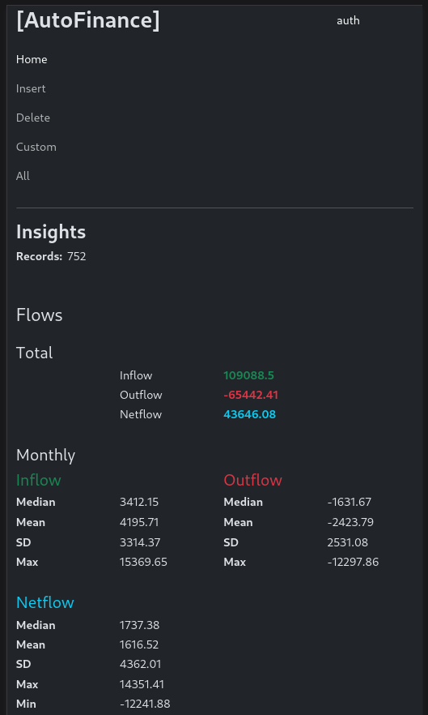
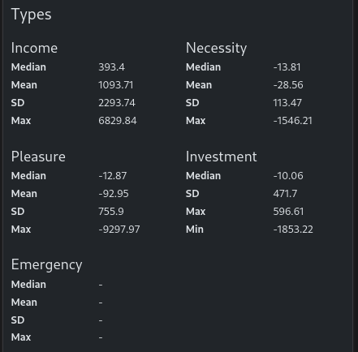
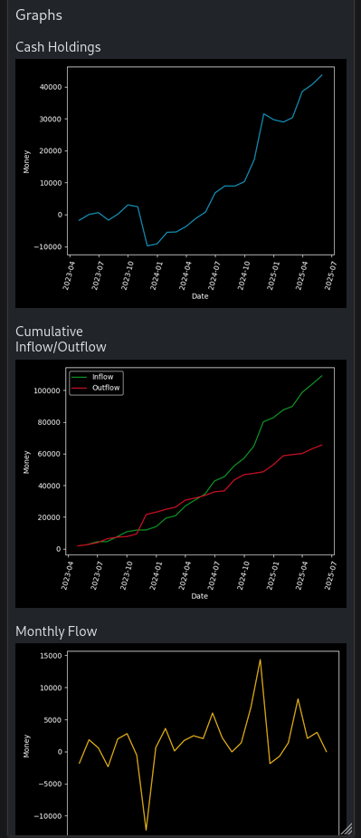
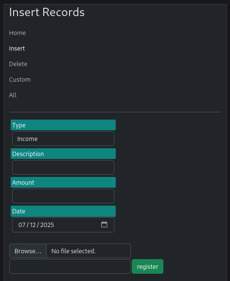
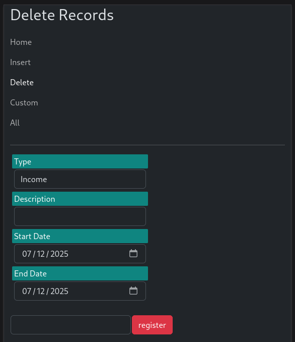
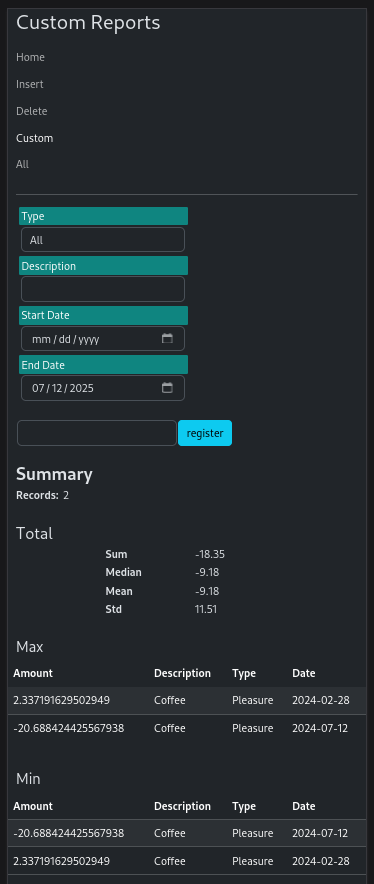
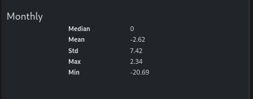
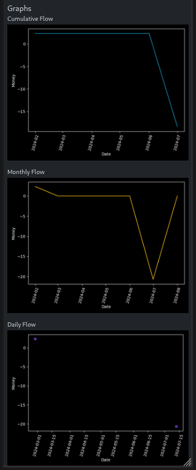
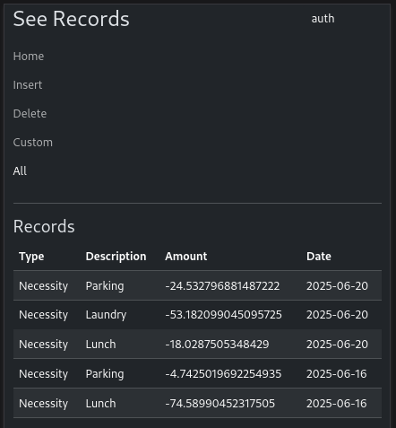

# AutoFinance
### *By Fernando Lavarreda*

Application designed to keep track of personal finances.

## About

This application is intended to analyze inflows and outflows in a convenient manner. Have you ever wondered were does your money get spent? 
Is it in food, rent, education, leisure? With these web application you can have insights on your spending and saving habits, through a
convenient procedure to log your cashflows.

## Usage & Overview

This is a lightweight web application to facilitate access to its potential users. 
It is made of 5 pages: Home, Insert, Delete, Custom, All

### Home

Its default view is blocked until the correct password is set for authentication.
Here a full summary/report is presented. At the very top are the total inflow, outflow 
and the netflow. Then you have descriptive statistics for each of these flows grouped by month.



The next section has descriptive statistics for each type of record.
The application by default is configured with 5 main types of entries:

- Income: typically inflows (your salary, bonuses, etc)
- Necessity: usually an outlow required to live (groceries, rent, etc)
- Pleasure: outflows made of leisure activities or non necessary items (concerts, cinema, ice cream, etc)
- Investment: is made of inflows and outflows (education, equipment, returns on bonds/actions, profit on selling a property) 
- Emergency: non-ortdinary outflows (hospital bills, veterinary, dentist, unplanned car repairs, etc)



The last section of the home page has a series of graphs for the cumulative flows as well as the monthly flows




### Insert

The insert page allows to add new entries to the database. Instead of adding entry by entry a series of entries can be
added at once by uploading a file. The file must follow the following specifications:

- Each line should correspond to an entry
- Each entry is formatted as: Type|Description|Amount|Date
  - Type should belong to the defined types of entries (eg. Income, Emergency, etc).
  - Description should be short (less than 150 characters).
  - Amount is a integer or decimal number.
  - Date must follow the format: YYYY-mm-dd 




### Delete

The delete page follows a similar layout to the insert page. Here the start and type of entry are required inputs.
If a description is provided any entry that contains that text in its description (case insensitive) will be deleted. 




### Custom

The custom page creates reports similar to the one in the home page with the added functionality to filter records. 
Here all inputs are optional. In the first section of this report, descriptive statistics of all filtered records are displayed.
Highlighting the max and min 5 records. 



The next section has descriptive statistics of the months selected.  




The last section has graphs of the cumulative net flow, monthly flow and daily flow for the data filtered. 




### All

The last page presents the last 30 entries. If the secondary password is provided it generates a backup file following the format
detailed in the [Insert Section](#insert). 




# Setup

1. For a quick setup you can start by cloning this repository.

  ```bash
  git clone https://github.com/FernandoLavarreda/AutoFinance
  cd autofinance
  ```

2. Create your virtual environment and install dependencies

    ```bash
   python3 -m venv venv
   source ./venv/bin/activate
   python3 -m pip install -r requirements.txt
   ```

3. Define the environment variables.
   - DBPASSWORD: [Argon](https://pypi.org/project/argon2-cffi/) password hash to view/insert/delete data
   - DBPASSWORD2: Argon password hash to download data
   - DATABASE: Path to database.
   - DATASOURCE: Path to file to initialize database (optional, if so create fake path). 
   
4. Start WebApp
   
    ```bash
   gunicorn --bind 0.0.0.0:5000 main:app
   ```

5. Next Steps

   With these you can access localhost and the port 5000 test the different functionalities of the App.
   Then you can proceed to deploy the application wherever you like!
